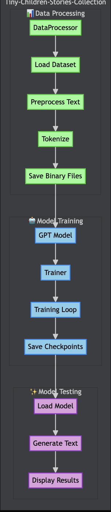
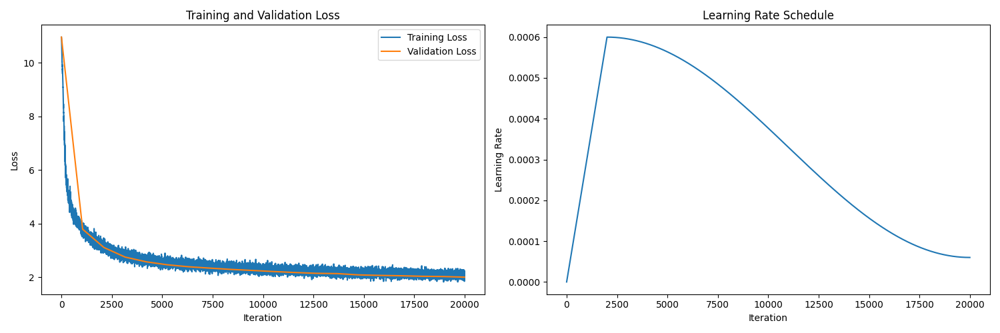

# Tiny-Children-Stories-30M-model

A customizable GPT-based model trained on children's stories to understand and generate clear, simple explanations.

## Features

- GPT-based model architecture
- LoRA (Low-Rank Adaptation) for efficient finetuning
- Training on children's stories for clear explanations
- Validation and finetuning splits for robust training
- Checkpointing and best model saving
- Weights & Biases integration for experiment tracking

## Architecture

The following diagram illustrates the end-to-end architecture and workflow for the Tiny-Children-Stories-Collection model:

<p align="center">
  
</p>

**Flow:**
- **Data Processing:** Loads and preprocesses the Children Stories Collection dataset, tokenizes the text, and saves it as binary files.
- **Model Training:** Trains a GPT model using the processed data, manages checkpoints, and supports mixed precision training.
- **Model Testing:** Loads the best model checkpoint and generates text from user prompts.

## Installation

1. Clone the repository:
```bash
git clone https://github.com/ideaweaver-ai/Tiny-Children-Stories-30M-model.git
cd Tiny-Children-Stories-30M-model
```

2. Run the setup script:
```bash
./setup.sh
```

The setup script will:
- Create the project structure
- Set up a virtual environment
- Install all dependencies
- Prepare the dataset
- Train the base model
- Optionally perform LoRA finetuning
- Test the trained model

You can find the trained models in:
- Base model: `checkpoints/Tiny-Children-Stories-Collection-model.pt`
- LoRA model: `lora_checkpoints/Tiny-Children-Stories-Collection-LoRA-model.pt`

## Usage

To generate text with your trained model:
```bash
python src/generate.py --prompt "In a magical forest"
```

**Sample Output:**
```
Using device: cuda
Loading model from checkpoints/best_model.pt...

Generating text...
Prompt: In a magical forest

Generated text:
--------------------------------------------------
In a magical forest full of vibrant colors and sounds. one day, while playing near the riverbank, they stumbled upon a group of friends gathered around a mysterious machine. this machine was a giant, colorful creature who could help solve problems. they decided to use the power of knowledge about how to use the machine to help solve complex problems. little timmy asked, "what do you think this machine is?" the machine replied, "i am programmed to understand patterns and patterns, but i can't figure out how to
--------------------------------------------------
```

## Output Files

The training process generates several important files:

- `train.bin` - Training data (80% of dataset)
- `validation.bin` - Validation data (10% of dataset)
- `finetune.bin` - Finetuning data (10% of dataset)
- `checkpoints/checkpoint_epoch_X.pt` - Regular checkpoints
- `checkpoints/best_model.pt` - Best model based on validation loss
- `lora_checkpoints/lora_checkpoint_epoch_X.pt` - Regular LoRA checkpoints
- `lora_checkpoints/best_lora_model.pt` - Best LoRA model
- `training_metrics.png` - Training and validation loss plot
- Weights & Biases logs (if enabled)

## Model Architecture

The model uses a GPT architecture with the following key components:
- Multi-head self-attention
- Layer normalization
- Feed-forward networks
- Position embeddings
- Token embeddings

## Training Process

1. **Base Training**:
   - Trains on 80% of the dataset
   - Validates on 10% of the dataset
   - Saves checkpoints every 5 epochs
   - Tracks best model based on validation loss

2. **LoRA Finetuning**:
   - Uses 10% of the dataset for finetuning
   - Applies low-rank adaptation to the base model
   - Saves best LoRA weights based on validation loss

## Training Metrics

<p align="center">
  
</p>

- **Left Plot:** Shows the training and validation loss over iterations. The rapid initial drop indicates the model is learning quickly, followed by a gradual decrease as it converges.
- **Right Plot:** Displays the learning rate schedule, with a warmup phase followed by a cosine decay, helping stabilize and optimize training.

## Dependencies

See `requirements.txt` for a complete list of dependencies. Key packages include:
- PyTorch
- Transformers
- PEFT (for LoRA)
- Weights & Biases
- Other utilities (tiktoken, numpy, etc.)

## Hardware Used

Training was performed on the following hardware:

- **GPU:** NVIDIA RTX 4090 (24 GB VRAM)
- **RAM:** 41 GB
- **CPU:** 6 vCPU

This setup enabled efficient training and experimentation with large datasets and models.

## License

This project is licensed under the MIT License - see the [LICENSE](LICENSE) file for details.

## Contributing

Contributions are welcome! Please feel free to submit a Pull Request.